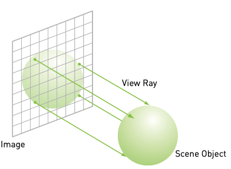
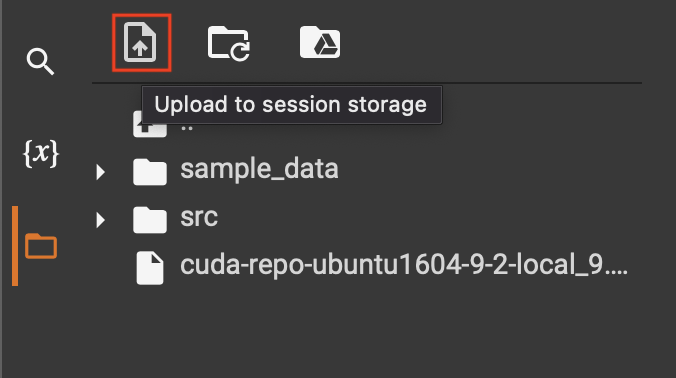

# TP5 : Programmation GPU en CUDA

#Note : Utilisation de CUDA 9.2, dans une cellule de code après nvcc mettre :

```
!apt-get --purge remove cuda nvidia* libnvidia-*
!dpkg -l | grep cuda- | awk '{print $2}' | xargs -n1 dpkg --purge
!apt-get remove cuda-*
!apt autoremove
!apt-get update
```

```
!wget https://developer.nvidia.com/compute/cuda/9.2/Prod/local_installers/cuda-repo-ubuntu1604-9-2-local_9.2.88-1_amd64 -O cuda-repo-ubuntu1604-9-2-local_9.2.88-1_amd64.deb
!dpkg -i cuda-repo-ubuntu1604-9-2-local_9.2.88-1_amd64.deb
!apt-key add /var/cuda-repo-9-2-local/7fa2af80.pub
!apt-get update
!apt-get install cuda-9.2
```


### Objectifs du TP :
---------------------
* Comprendre et observer les différences entre la mémoire constante et la mémoire globale
* Comprendre comment utiliser la mémoire de texture pour les problèmes qui correspondent naturellement à des domaines 2D.

### Informations sur le TP :
----------------------------
* Le TP est à réaliser seul ou en binôme.
* A rendre sur ametice en spécifiant si vous avez fait le TP seul ou en binôme, en mentionnant votre prénom ainsi que votre nom (prénom et nom de chaque membre si en binôme).
* A rendre avant le 13 avril 2024, 00:00.

### Notes:
----------
Dans les programmes suivant : 
- **input_image_file(const char\* filename, uchar4* image)** vous permet de lire l'image input.ppm et de la charger en mémoire.
- **output_image_file(uchar4* image)** permet de sauvegarder l'image output.ppm sur disque
- Dans une image en couleur (RGB), chaque pixel contient 3 valeurs, une pour chaque channel R, G et B. Ces valeurs sont comprises entre 0 et 255. Pour cela nous utilisons le type **uchar4**.

#### uchar4
Un uchar4 est une structure de données qui représente un vecteur de quatre octets (8 bits chacun) non signés. Le préfixe "u" signifie "unsigned", ce qui indique que les valeurs stockées dans les octets sont supérieur à 0. 

```c 
typedef struct {
   unsigned char x, y, z, w;
} uchar4;
```

Ici nous nous intéréssons aux 3 premières valeurs x, y, z représentant les channel R(rouge), G(vert), B(bleu). w est laissé à 255.

### Exercice 1 : Ray tracing et mémoire constante
-------------------------------------------------

Pour cet exercice, vous allez optimiser une application simple de ray tracing en passant de la mémoire globale à la mémoire constante.

Le ray tracing est une façon de produire une image 2D à partir d'une scène composée d'objets 3D.

Nous choisissons un endroit de notre scène pour y placer une caméra (un point dans notre scène 3D). Cette contient contient un "capteur de lumière". Pour produire une image, nous devons donc déterminer la lumière qui atteindra ce capteur. Chaque pixel de l'image résultante doit être de la même couleur et de la même intensité que le rayon de lumière qui frappe le capteur.


Étant donné que la lumière incidente en tout point du capteur peut provenir de n'importe quel endroit de la scène, on va tricher et faire partir les rayon depuis notre caméra (moins complexe). Donc, plutôt que d'essayer de déterminer quel rayon lumineux frappe le pixel en question, imaginons que nous tirons un rayon depuis le pixel vers l'intérieur de la scène. De cette manière, chaque pixel se comporte un peu comme un œil qui "regarde" la scène.



Pour produire des rendus de haute résolution et plus complexe, les rayons intersectant un objet 3D sont renvoyés en direction de chaque source de lumière pour déterminer sa luminosité (l'objet est-il éclairé ou à l'ombre d'autres objets ?). Cette luminosité, combinée avec les propriétés de la surface de l'objet (sa couleur, sa rugosité, etc.), ainsi que d'autres informations éventuelles (angles entre la normale à l'objet et les sources de lumières, réflexions, transparence, etc...), déterminent la couleur finale du pixel.

Dans le code, les sphère sont modélisé avec une structure de données qui stocke les coordonnées du centre de la sphère (x, y, z), son rayon et sa couleur (r, b, g). la structure possède une fonction appelée sphere_intersect( float ox, float oy, float *n ). Compte tenu d'un rayon tiré à partir du pixel situé à (ox, oy), cette fonction calcule si le rayon coupe la sphère. Si le rayon coupe effectivement la sphère, la fonction calcule la distance de la caméra à laquelle le rayon touche la sphère. Si le rayon touche plus d'une sphère, seule la sphère la plus proche est visible.

Prenez du temps pour comprendre ce que fait le code.

Après avoir terminé les étapes permettant d'utiliser la mémoire constante, modifiez les valeurs de MAX_SPHERE et IMAGE_DIM afin de completer le tableau de temps suivant. Que constatez-vous ?


### Exercice 2 : Flou d'image et mémoire de texture
---------------------------------------------------

Dans cet exercice, vous allez expérimenter l'utilisation de la mémoire de texture. Dans cet exemple, nous allons utiliser explicitement la mémoire de texture plutôt que d'utiliser des qualificateurs pour forcer les chargements de mémoire via le cache en lecture seule. Il y a de bonnes raisons de le faire lorsqu'il s'agit de problèmes liés aux images ou de problèmes qui se décomposent naturellement en 2 dimensions. 

Vous allez implémenter un flou d'image. Jetez un œil au code du kernel pour essayer de le comprendre.
Sur guthub vous avez une image input.ppm. Afin de faire fonctionner le code, il faut dans un premier téléversé l'image input.ppm sur google colab.



Bon TP !
